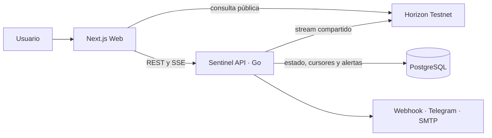

# Stellar Account Inspector

> Inspección, evaluación de riesgo y monitoreo en tiempo real de cuentas Stellar Testnet.

[](https://github.com/VillaAlexTor/Stellar-account-inspector/actions/workflows/ci.yml)
[](https://developers.stellar.org/docs/networks/testnet)
[](https://nextjs.org/)
[](https://go.dev/)

**Stellar Account Inspector** es una plataforma educativa que transforma la configuración técnica de una cuenta Stellar en información comprensible y accionable. Permite consultar una clave pública, identificar configuraciones de riesgo y activar un monitor persistente que detecta cambios sensibles sin solicitar claves privadas.

> [!IMPORTANT]
> El proyecto trabaja exclusivamente con **Stellar Testnet**. Nunca introduzcas una seed phrase, clave secreta ni fondos reales.

## Contenido

- [Qué incluye](#qué-incluye)
- [Cómo funciona](#cómo-funciona)
- [Instalación rápida con Docker](#instalación-rápida-con-docker)
- [Primer recorrido](#primer-recorrido)
- [Configuración](#configuración)
- [Desarrollo local](#desarrollo-local)
- [Verificación y pruebas](#verificación-y-pruebas)
- [Arquitectura](#arquitectura)
- [API y puertos](#api-y-puertos)
- [Seguridad y privacidad](#seguridad-y-privacidad)
- [Solución de problemas](#solución-de-problemas)
- [Documentación](#documentación)
- [Contribución y mantenimiento](#contribución-y-mantenimiento)
- [Licencia](#licencia)

## Qué incluye

| Módulo | Propósito | Estado |
| --- | --- | :---: |
| **Inspector** | Consulta una cuenta pública y presenta balances, activos, firmantes, umbrales y reservas. | ✅ Implementado |
| **Risk Score** | Evalúa reglas de seguridad y explica por qué una configuración aumenta o reduce el riesgo. | ✅ Implementado |
| **Sentinel** | Monitorea operaciones mediante SSE, persiste el estado y genera alertas en tiempo real. | ✅ Implementado |

Funciones destacadas:

- consulta directa a Horizon Testnet;
- análisis local que no requiere seeds ni claves privadas;
- detección de cambios en firmantes, pesos, umbrales, trustlines y master key;
- historial paginado de alertas y operaciones relevantes;
- reanudación del monitoreo mediante checkpoints persistidos;
- sesiones protegidas, CORS estricto y límites por IP y cuenta;
- notificaciones opcionales por webhook firmado, Telegram o SMTP;
- métricas Prometheus, logs JSON, liveness y readiness;
- interfaz adaptable con mensajes y severidades que no dependen solamente del color.

## Cómo funciona

1. El usuario introduce una **clave pública** que empieza con `G`.
2. Inspector consulta Horizon Testnet y normaliza la información de la cuenta.
3. Risk Score aplica reglas explicativas sobre su configuración de seguridad.
4. Al activar Sentinel, la API registra la cuenta y abre una sesión SSE compartida hacia Horizon.
5. Cada cambio relevante se compara con el último estado conocido, se persiste en PostgreSQL y se transmite al navegador.

La reserva bloqueada se muestra con el alcance definido para esta versión:

```text
(2 + subentry_count) × 0.5 XLM
```

## Instalación rápida con Docker

Esta es la opción recomendada para un jurado, revisor o responsable de evaluación. Levanta la interfaz, la API y PostgreSQL con una sola herramienta.

### Requisitos

- [Git](https://git-scm.com/downloads), si se clonará el repositorio;
- [Docker Desktop](https://www.docker.com/products/docker-desktop/) iniciado;
- conexión a Internet durante la primera construcción y para consultar Stellar Testnet;
- puertos locales `3000`, `8081` y `5433` disponibles.

### 1. Descargar el proyecto

**Opción A — Git**

```bash
git clone https://github.com/VillaAlexTor/Stellar-account-inspector.git
cd Stellar-account-inspector
```

**Opción B — ZIP**

Descarga [la rama principal en formato ZIP](https://github.com/VillaAlexTor/Stellar-account-inspector/archive/refs/heads/main.zip), descomprímela y abre una terminal dentro de la carpeta extraída.

### 2. Crear la configuración local

En Windows PowerShell:

```powershell
Copy-Item .env.example .env
```

En macOS o Linux:

```bash
cp .env.example .env
```

El archivo de ejemplo deja la autenticación desactivada para que la demostración local pueda abrirse directamente. No uses esa configuración para publicar el sistema en Internet.

### 3. Levantar los servicios

```bash
docker compose up -d --build
```

La primera ejecución puede tardar mientras Docker descarga las imágenes y construye la aplicación. Comprueba el estado con:

```bash
docker compose ps
```

Los tres servicios deben aparecer como iniciados; PostgreSQL debe indicar que está saludable.

### 4. Abrir la aplicación

Visita [http://localhost:3000](http://localhost:3000).

También puedes verificar la API:

```bash
curl http://localhost:8081/healthz
curl http://localhost:8081/readyz
```

En PowerShell, si `curl` no está disponible:

```powershell
Invoke-RestMethod http://localhost:8081/healthz
Invoke-RestMethod http://localhost:8081/readyz
```

### 5. Detener el proyecto

```bash
docker compose down
```

Este comando conserva los datos de PostgreSQL. Para eliminar también el volumen local y empezar desde cero, usa deliberadamente `docker compose down -v`.

## Primer recorrido

1. Abre el Inspector en `http://localhost:3000`.
2. Introduce una clave pública activa de Stellar Testnet.
3. Revisa balances, firmantes, umbrales y el Risk Score.
4. Selecciona **Activar Sentinel**.
5. Abre la vista de monitoreo de la cuenta.
6. Realiza una operación controlada en Testnet y observa el evento y la alerta sin recargar la página.

Inspector también admite enlaces directos:

```text
http://localhost:3000/?account=CLAVE_PUBLICA
http://localhost:3000/sentinel/CLAVE_PUBLICA
```

Para generar cuentas nuevas de demostración —saludable, con umbrales inconsistentes y con master key de peso cero— consulta [Datos de prueba](#datos-de-prueba).

## Configuración

La instalación local funciona con los valores de `.env.example`. Estas son las variables más importantes:

| Variable | Valor local predeterminado | Uso |
| --- | --- | --- |
| `NEXT_PUBLIC_SENTINEL_API_URL` | `http://localhost:8081` | URL de la API utilizada por el navegador. |
| `SENTINEL_ALLOWED_ORIGINS` | `http://localhost:3000` | Orígenes autorizados por CORS. |
| `SENTINEL_AUTH_TOKENS` | vacío | Tokens de acceso separados por comas. Vacío sólo para desarrollo local. |
| `SENTINEL_SESSION_SECRET` | vacío | Secreto para cookies firmadas; en producción debe tener al menos 32 caracteres. |
| `SENTINEL_COOKIE_SECURE` | `false` | Debe ser `true` cuando se use HTTPS. |
| `POSTGRES_HOST_PORT` | `5433` | Puerto de PostgreSQL expuesto en el equipo. |
| `SENTINEL_HOST_PORT` | `8081` | Puerto de la API expuesto en el equipo. |
| `WEB_HOST_PORT` | `3000` | Puerto de la interfaz web. |

Después de cambiar variables utilizadas durante la construcción del frontend, recrea los contenedores:

```bash
docker compose up -d --build
```

La referencia completa está en [`docs/production/environment.md`](docs/production/environment.md). Las notificaciones son opcionales y se documentan en [`docs/notifications.md`](docs/notifications.md).

### Cambiar un puerto ocupado

Por ejemplo, para servir la interfaz en `3001`, modifica `.env`:

```dotenv
WEB_HOST_PORT=3001
SENTINEL_ALLOWED_ORIGINS=http://localhost:3001
```

Después ejecuta `docker compose up -d --build` y abre `http://localhost:3001`.

## Desarrollo local

### Requisitos adicionales

- Node.js `22.12` o superior;
- pnpm `10.33.3` —la versión está fijada en `package.json`—;
- Go `1.25.14`, únicamente para ejecutar o probar la API fuera de Docker.

### Sólo Inspector y Risk Score

```bash
pnpm install --frozen-lockfile
pnpm dev
```

Abre `http://localhost:3000`. Este modo ejecuta solamente el frontend; las funciones de Sentinel requieren su API y PostgreSQL.

### Entorno híbrido para desarrollar Sentinel

Levanta únicamente la base de datos y la API en Docker:

```bash
docker compose up -d --build postgres sentinel-api
pnpm install --frozen-lockfile
pnpm dev
```

Así, Next.js conserva recarga en caliente en el puerto `3000`, la API queda en `8081` y PostgreSQL en `5433`. Para observar los logs:

```bash
docker compose logs -f sentinel-api
```

## Verificación y pruebas

Antes de presentar o publicar cambios, ejecuta:

```bash
pnpm test
pnpm lint
pnpm build
pnpm sentinel:test
pnpm sentinel:test:integration
```

| Comando | Comprueba |
| --- | --- |
| `pnpm test` | Componentes, reglas y comportamiento del frontend. |
| `pnpm lint` | Calidad estática del código TypeScript y React. |
| `pnpm build` | Construcción de producción de Next.js. |
| `pnpm sentinel:test` | Reglas, stream, autenticación, límites y notificaciones de la API Go. |
| `pnpm sentinel:test:integration` | Flujo real API–PostgreSQL–SSE en un entorno aislado. |

La integración necesita Docker. La especificación ampliada está en [`docs/testing.md`](docs/testing.md).

### Datos de prueba

```bash
pnpm --filter @stellar-inspector/web testnet:provision
```

El script utiliza Friendbot, imprime únicamente claves públicas y omite deliberadamente las claves secretas. Stellar Testnet puede reiniciarse, por lo que estos ejemplos se generan bajo demanda.

## Arquitectura



- **Frontend:** Next.js, React, TypeScript y Zustand.
- **Backend:** Go, GORM y una sesión compartida de Horizon por cuenta.
- **Persistencia:** PostgreSQL para cuentas, operaciones, alertas y entregas.
- **Tiempo real:** Server-Sent Events desde Horizon hacia la API y desde la API hacia el navegador.
- **Operación:** Docker Compose, health checks, métricas Prometheus y logs estructurados.

Sentinel guarda el cursor y el estado siguiente en la misma transacción que la operación y sus alertas. Al reiniciarse, retoma el stream desde el checkpoint persistido y evita comparar eventos antiguos contra un snapshot nuevo.

Consulta [`docs/architecture.md`](docs/architecture.md) para conocer las decisiones técnicas.

## API y puertos

### Puertos locales

| Servicio | Dirección |
| --- | --- |
| Interfaz web | `http://localhost:3000` |
| Sentinel API | `http://localhost:8081` |
| PostgreSQL | `localhost:5433` |

### Endpoints principales

| Método y ruta | Propósito |
| --- | --- |
| `GET /healthz` | Confirma que el proceso está activo. |
| `GET /readyz` | Comprueba la conexión con PostgreSQL. |
| `POST /api/v1/auth/session` | Intercambia un token por una cookie de sesión. |
| `POST /api/v1/monitored-accounts` | Registra o recupera una cuenta monitoreada. |
| `GET /api/v1/monitored-accounts/{publicKey}` | Consulta el estado de una cuenta. |
| `GET /api/v1/monitored-accounts/{publicKey}/alerts` | Devuelve el historial paginado. |
| `GET /api/v1/monitored-accounts/{publicKey}/events` | Abre el canal SSE en tiempo real. |
| `GET /metrics` | Expone métricas Prometheus; requiere autenticación cuando está habilitada. |

Consulta ejemplos y detalles de autenticación en [`docs/api.md`](docs/api.md).

### PostgreSQL desde DBeaver

Con la configuración local predeterminada:

| Campo | Valor |
| --- | --- |
| Host | `localhost` |
| Puerto | `5433` |
| Base de datos | `stellar_inspector` |
| Usuario | `stellar` |
| Contraseña | `stellar` |
| SSL | desactivado |

Tablas principales: `monitored_accounts`, `relevant_operations`, `sentinel_alerts` y `notification_deliveries`.

## Seguridad y privacidad

- El sistema acepta **claves públicas**, nunca seeds ni claves privadas.
- Inspector consulta Horizon y calcula el riesgo sin custodiar fondos.
- Sentinel puede exigir tokens y utiliza cookies firmadas `HttpOnly` y `SameSite=Strict`.
- Los límites de uso se aplican por IP y por cuenta Stellar.
- `X-Forwarded-For` sólo se acepta desde proxies configurados explícitamente.
- Las entregas webhook pueden firmarse con HMAC y tienen identificadores para deduplicación.
- Los secretos locales se guardan en archivos `.env` ignorados por Git.

Para producción se requieren HTTPS, tokens aleatorios, un secreto independiente de al menos 32 caracteres, PostgreSQL sin exposición pública y copias de seguridad verificadas. Revisa [`SECURITY.md`](SECURITY.md) y [`docs/production-checklist.md`](docs/production-checklist.md) antes de publicar el servicio.

## Solución de problemas

| Problema | Comprobación o solución |
| --- | --- |
| Docker no inicia los servicios | Confirma que Docker Desktop esté abierto y ejecuta `docker compose ps`. |
| El puerto ya está en uso | Cambia `WEB_HOST_PORT`, `SENTINEL_HOST_PORT` o `POSTGRES_HOST_PORT` en `.env`. |
| La web abre, pero Sentinel no conecta | Comprueba `http://localhost:8081/readyz` y revisa `docker compose logs sentinel-api`. |
| El navegador bloquea la API por CORS | `SENTINEL_ALLOWED_ORIGINS` debe coincidir exactamente con la URL de la web. |
| Una cuenta no existe | Verifica que sea una clave pública activa en **Testnet**, no en la red pública. |
| No aparecen eventos | Mantén abierta la vista Sentinel y realiza una operación posterior a la activación del monitor. |
| Se cambió una variable y no tiene efecto | Ejecuta nuevamente `docker compose up -d --build`. |
| Se desea reiniciar la demostración | Ejecuta `docker compose down -v` sabiendo que eliminará los datos locales. |

Diagnóstico rápido:

```bash
docker compose ps
docker compose logs --tail=100 sentinel-api
docker compose logs --tail=100 web
```

## Estructura del repositorio

```text
.
├── apps/web/                 # Interfaz Next.js, Inspector y Risk Score
├── services/sentinel-api/    # API Go, reglas, persistencia y SSE
├── docs/                     # Guías técnicas, operación y propuesta
├── deploy/                   # Recursos auxiliares de despliegue
├── compose.yaml              # Demostración y desarrollo local
├── compose.prod.yaml         # Despliegue con Caddy y HTTPS
├── Caddyfile                 # Proxy inverso de producción
├── PRODUCT.md                # Contexto y principios del producto
└── SECURITY.md               # Política y modelo de seguridad
```

## Documentación

| Documento | Contenido |
| --- | --- |
| [`docs/local-demo.md`](docs/local-demo.md) | Preparación de una demostración local sin dominio ni servidor. |
| [`docs/architecture.md`](docs/architecture.md) | Flujo de datos y decisiones de arquitectura. |
| [`docs/api.md`](docs/api.md) | Contrato HTTP, autenticación, límites y SSE. |
| [`docs/testing.md`](docs/testing.md) | Pruebas unitarias, integración y seguridad. |
| [`docs/notifications.md`](docs/notifications.md) | Webhooks, Telegram, SMTP y reintentos. |
| [`docs/observability.md`](docs/observability.md) | Logs, métricas, consultas y alertas operativas. |
| [`docs/deployment.md`](docs/deployment.md) | Opciones y requisitos de despliegue. |
| [`docs/production-checklist.md`](docs/production-checklist.md) | Lista de verificación previa a producción. |
| [`docs/Stellar_Account_Inspector_Propuesta_e_Implementacion.docx`](docs/Stellar_Account_Inspector_Propuesta_e_Implementacion.docx) | Propuesta, implementación, decisiones y roadmap del proyecto. |

## Alcance

El proyecto demuestra análisis y monitoreo técnico sobre Stellar Testnet. No es una cartera, no firma transacciones, no custodia activos, no sustituye una auditoría de seguridad y no constituye asesoramiento financiero.

Si encuentras una vulnerabilidad, sigue el proceso de reporte responsable descrito en [`SECURITY.md`](SECURITY.md) y evita publicar secretos o detalles explotables en un issue público.

## Contribución y mantenimiento

Antes de proponer un cambio:

1. crea una rama descriptiva desde `main`;
2. mantén el cambio limitado a una responsabilidad;
3. añade o actualiza pruebas cuando cambie el comportamiento;
4. ejecuta lint, pruebas y build antes de abrir la revisión;
5. documenta cualquier variable, migración o decisión operativa nueva.

Las incidencias funcionales pueden registrarse en [GitHub Issues](https://github.com/VillaAlexTor/Stellar-account-inspector/issues). Los reportes de seguridad deben seguir exclusivamente el canal privado descrito en [`SECURITY.md`](SECURITY.md).

El repositorio es mantenido desde la cuenta [VillaAlexTor](https://github.com/VillaAlexTor).

## Licencia

Este repositorio no incluye actualmente una licencia de software abierta. El código está disponible para revisión y evaluación; solicita autorización al responsable del proyecto antes de redistribuirlo o reutilizarlo fuera de ese alcance.
