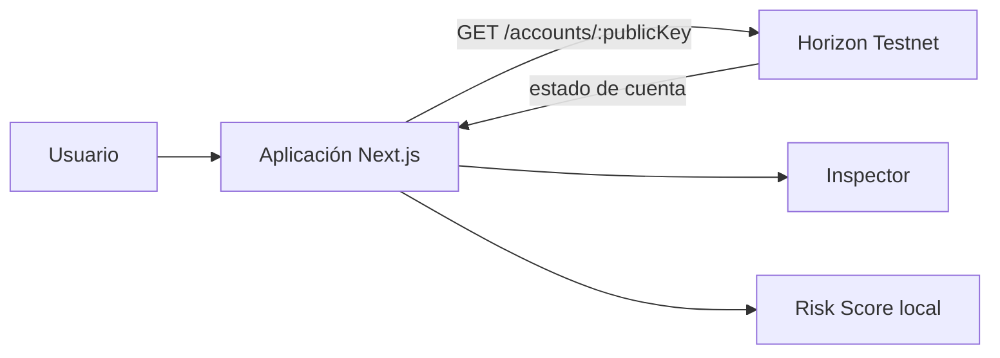

# Stellar Account Inspector

> Inspector y evaluador de riesgo para cuentas Stellar Testnet, ejecutado completamente en el navegador.

[](https://github.com/VillaAlexTor/Stellar-account-inspector/actions/workflows/ci.yml)
[](https://developers.stellar.org/docs/networks/testnet)
[](https://nextjs.org/)
[](https://www.typescriptlang.org/)

**Stellar Account Inspector** transforma la respuesta técnica de Horizon en una lectura clara de balances, reservas, trustlines, firmantes, umbrales y controles del emisor. Sobre esos datos calcula un Risk Score determinista y explica cada hallazgo con evidencia observable.

La versión de `main` corresponde al alcance formal del curso: **frontend puro, sin servidor propio y sin base de datos propia**.

> [!IMPORTANT]
> La aplicación usa exclusivamente **Stellar Testnet**. Sólo solicita claves públicas que comienzan con `G`; nunca solicita, recibe ni almacena seeds o claves privadas.

## Contenido

- [Alcance evaluado](#alcance-evaluado)
- [Instalación](#instalación)
- [Uso](#uso)
- [Qué analiza](#qué-analiza)
- [Arquitectura](#arquitectura)
- [Risk Score](#risk-score)
- [Pruebas](#pruebas)
- [Estructura](#estructura)
- [Extensión opcional Sentinel](#extensión-opcional-sentinel)
- [Documentación](#documentación)

## Alcance evaluado

| Instrumento | Función | Ejecución |
| --- | --- | --- |
| **Inspector** | Consulta y organiza el estado actual de una cuenta. | Navegador → Horizon Testnet |
| **Risk Score** | Evalúa reglas de seguridad y explica los hallazgos. | Cálculo local en el navegador |

La entrega no necesita API propia, PostgreSQL, Docker, proxy, autenticación de servidor ni servicios de notificación. Horizon es la única fuente externa de datos.

## Instalación

### Requisitos

- [Node.js](https://nodejs.org/) `22.12` o superior.
- pnpm `10.33.3`.
- Git, únicamente si se clonará el repositorio.
- Conexión a Internet para instalar dependencias y consultar Horizon Testnet.

### 1. Descargar el proyecto

Con Git:

```bash
git clone https://github.com/VillaAlexTor/Stellar-account-inspector.git
cd Stellar-account-inspector
```

También puedes [descargar la rama `main` como ZIP](https://github.com/VillaAlexTor/Stellar-account-inspector/archive/refs/heads/main.zip), descomprimirla y abrir una terminal dentro de la carpeta.

### 2. Preparar pnpm

```bash
corepack enable
corepack prepare pnpm@10.33.3 --activate
```

Si `corepack` no está disponible:

```bash
npm install --global pnpm@10.33.3
```

### 3. Instalar y ejecutar

```bash
pnpm install --frozen-lockfile
pnpm dev
```

Abre [http://localhost:3000](http://localhost:3000). No es necesario crear un archivo `.env` ni iniciar servicios adicionales.

Para detener el servidor local, presiona `Ctrl + C` en la terminal.

## Uso

1. Abre la aplicación.
2. Introduce una clave pública activa de Stellar Testnet.
3. Selecciona **Inspeccionar**.
4. Revisa la lectura de cuenta y el Risk Score.
5. Abre Stellar Expert desde el resultado si necesitas contrastar la cuenta en otro explorador.

También puedes compartir una consulta mediante URL:

```text
http://localhost:3000/?account=CLAVE_PUBLICA
```

## Qué analiza

- balance nativo XLM;
- reserva mínima estimada y balance disponible;
- subentradas y secuencia;
- trustlines, activos, límites y emisores;
- flags `auth_required`, `auth_revocable`, `auth_immutable` y `auth_clawback_enabled`;
- firmantes, tipos, pesos y configuración multifirma;
- umbrales bajo, medio y alto;
- última modificación informada por Horizon.

La reserva usada por esta versión sigue el alcance del instrumento:

```text
(2 + subentry_count) × 0.5 XLM
```

## Arquitectura



El navegador valida la clave pública, consulta Horizon y normaliza la respuesta. Las reglas del Risk Score son funciones puras e independientes; no existen escrituras, sesiones de servidor ni persistencia propia.

## Risk Score

El resultado se limita al rango `0–100`. Cada regla devuelve un hallazgo con identificador, severidad, título y explicación.

| Regla | Qué detecta |
| --- | --- |
| Master key debilitada | Master key con peso cero sin respaldo suficiente. |
| Umbrales inconsistentes | Orden o valores que reducen la protección esperada. |
| Emisor revocable | Trustline cuyo emisor puede revocar autorización. |
| Reserva disponible baja | Menos del 10 % del balance nativo permanece disponible. |
| Hash-lock con peso alto | Un `sha256_hash` puede alcanzar el umbral alto al revelar su preimagen. |
| Transacción preautorizada con peso alto | Un `preauth_tx` puede alcanzar el umbral alto al publicarse la transacción específica. |

`sha256_hash` y `preauth_tx` se evalúan por separado porque representan mecanismos de autorización distintos en Stellar.

## Pruebas

Ejecuta la verificación completa antes de una entrega:

```bash
pnpm lint
pnpm test
pnpm build
```

Para crear escenarios actualizados en Stellar Testnet:

```bash
pnpm --filter @stellar-inspector/web testnet:provision
```

El script usa Friendbot, muestra únicamente claves públicas y no imprime secretos. Testnet puede reiniciarse, por lo que los datos se generan bajo demanda.

## Estructura

```text
.
├── apps/web/
│   ├── app/                 # Página y estilos globales
│   ├── components/          # Inspector, Risk Score y componentes UI
│   ├── lib/stellar.ts       # Consulta y normalización de Horizon
│   ├── lib/risk/            # Reglas independientes
│   ├── scripts/             # Generación reproducible de cuentas Testnet
│   ├── public/materials/    # Texturas utilizadas por la interfaz
│   └── tests/               # Fixtures y pruebas unitarias
├── docs/                    # Arquitectura, pruebas y alcance
├── DESIGN.md                # Sistema visual
├── PRODUCT.md               # Propósito y límites del producto
└── SECURITY.md              # Consideraciones de seguridad
```

## Extensión opcional Sentinel

Sentinel fue una ampliación técnica con Go, PostgreSQL, SSE, Docker y notificaciones. No forma parte del entregable evaluado ni es necesaria para ejecutar Inspector y Risk Score.

La implementación completa se conserva como trabajo de portafolio en la rama [`Retro`](https://github.com/VillaAlexTor/Stellar-account-inspector/tree/Retro). Consulta [`docs/sentinel-extension.md`](docs/sentinel-extension.md) para conocer la separación de alcance.

## Documentación

| Documento | Contenido |
| --- | --- |
| [`docs/architecture.md`](docs/architecture.md) | Flujo de datos del frontend y decisiones técnicas. |
| [`docs/testing.md`](docs/testing.md) | Pruebas, fixtures y validación de la entrega. |
| [`docs/final-review.md`](docs/final-review.md) | Trazabilidad del ajuste solicitado para la entrega formal. |
| [`docs/sentinel-extension.md`](docs/sentinel-extension.md) | Alcance y ubicación de la extensión opcional. |
| [`SECURITY.md`](SECURITY.md) | Modelo de seguridad y reporte responsable. |

## Limitaciones

- Funciona únicamente con Stellar Testnet.
- El Risk Score es heurístico y no sustituye una auditoría profesional.
- La aplicación no firma transacciones, no conecta wallets y no custodia activos.
- La disponibilidad de los datos depende de Horizon Testnet.

## Licencia

El repositorio no incluye actualmente una licencia de software abierta. El código está disponible para revisión y evaluación; solicita autorización al responsable antes de redistribuirlo o reutilizarlo fuera de ese alcance.


